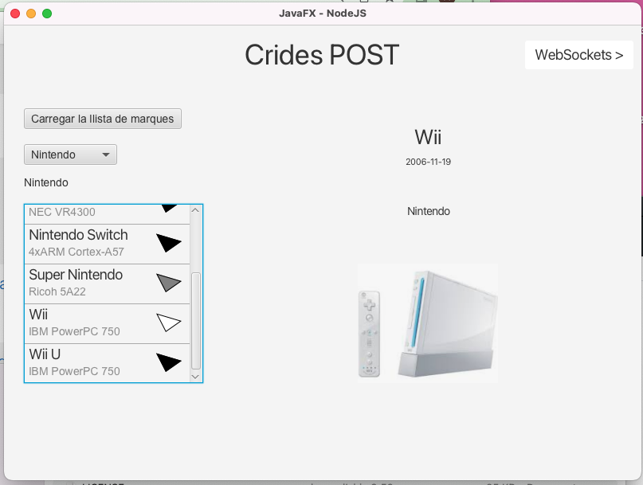
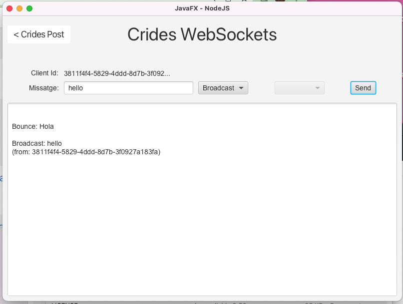
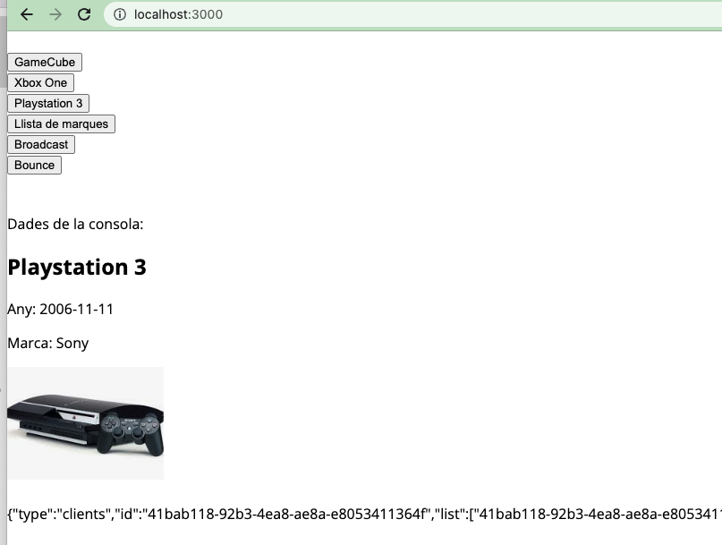

# JavaFXNodeJSExempleGetPostWebSockets
 
En aquest projecte hi ha un exemple de com comunicar JavaFX amb un servidor NodeJS

### Compilació i funcionament JavaFX ###

Cal el 'Maven' per compilar el projecte
```bash
cd JavaFX
mvn clean
mvn compile
```

Per executar el projecte a Windows cal
```bash
.\run.ps1 com.project.Main
```

Per executar el projecte a Linux/macOS cal
```bash
cd JavaFX
./run.sh com.project.Main
```

### Funcionament NodeJS ###

Cal el 'Maven' per compilar el projecte
```bash
cd NodeJS
npm install
```

Per executar el servidor en mode desenvolupament
```bash
cd NodeJS
npm run dev
```

Captura amb JavaFX





Captura amb Web


